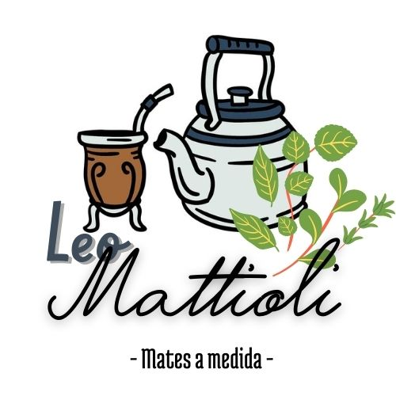

---
# Ecommerce-Backend "Leo Mattioli"
Proyecto tienda de productos materos completo, centrado en Backend, realizado principalmente con **NodeJS y MySQL**

 

## Tecnologías utilizadas

### Frontend
- HTML5
- CSS3 Puro

### Backend
- Javascript (Node.JS +  Express.JS)
- EJS (Motor de plantilla)

### Base de Datos
- MySQL

### Encriptación 
- Bcrypt

---

## Principales características
+ *Base de Datos MySQL*
+ *Tabla de usuarios registrados y ventas realizadas*
+ *Encriptación de claves mediante Bcrypt*
+ *Sistema de registro y logueo de usuarios*
+ *Sistema de compra de productos*
+ **Proximamente** *Usuario con permisos de Administrador para la carga de nuevos productos*

---

## Páginas a mostrar

+ Principal
+ Compra de producto
+ Sobre la empresa
+ Carrito de compras
+ Registro de usuario
+ Logeo de usuario

 

